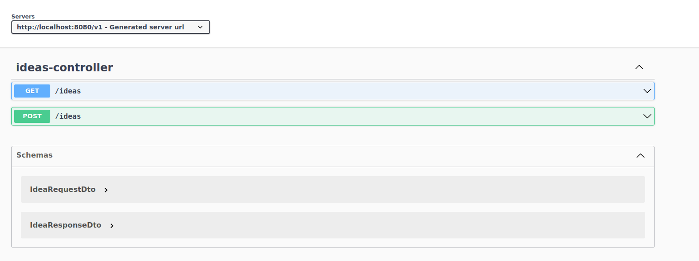

# mangopay-backend

Solution to the task: REST api with two endpoints:

- get all ideas,
- add new idea.

### You can use curl commands to test endpoints:

1. to create ideas:
``` 
curl 'http://localhost:8080/v1/ideas' \
--header 'Content-Type: application/json' \
--data '{
"owner": "John Doe",
"title": "Super idea for something",
"shortDescription": "General idea",
"details": "The details of the idea. Huge amount of info."
}
'
```

2. to get all ideas:
``` 
curl  'http://localhost:8080/v1/ideas'
```

### Documentation

Visit http://localhost:8080/v1/swagger-ui/index.html to check documentation.
It looks like in the following picture:
